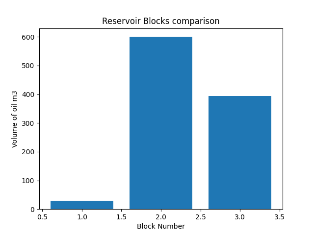

# Reservoir calculator
python + jupyter notebook for petroleum engineers to calculate total oil volume across multiple reservoir blocks.
## Features
- Calculate oil volume from area, thickness, porosity input
- Auto-generates reservoir_report.txt with formatted results.
- visualizes block comparison with matplotlib bar chart
- Built in Google colab for easy cloud execution
### Tech Stack
Python | jupyter Notebook | Matplotlib | file I/O
### Sample Output

### How to Run
1. Open reservoir_calculator.1pynb in Google colab
2. Run all cells
3. Check generated reservoir-report and reservoir_chart.png
